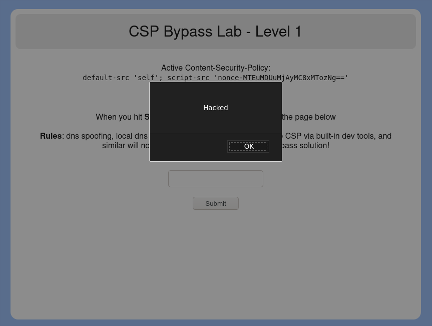

# CSP Bypass Level 1

## content-security-policy header
`default-src 'self'; script-src 'nonce-MTEuMDUuMjAyMC8xMTozNg=='`

### Analysis
Taking a look at the header, there are two components:
- [`default-src`](#default-src)
- [`script-src`](#script-src)

#### default-src
The `default-src` component is set to `self`, which means, that only scripts on the same domain can be executed.

#### script-src
`script-src` controls, which scripts you can exactly run. In our case it's restricted to a nonce, which is, at least at this time, set at `MTEuMDUuMjAyMC8xMTozNg==`. Taking a closer look, it's pretty obvious that this is a Base64 String. Decoded, it looks like this: `11.05.2020/11:39`.

I think it's obvious on how we are able to bypass that restriction. It's pretty insecure to just use the date and time as a nonce. A nonce should be one-time-use **only**! Since the nonce is dependent on hours and minutes only, the nonce gets changed only one time per minute. So we are able to run the exploit by just specifying the nonce in our inline-script tag.

## The exploit
To make it short, in our case, this code gets run when inputted into the inputbox:
```html
<script none="MTEuMDUuMjAyMC8xMTozNg==">alert("Hacked");</script>
```

## Fixing
The only thing one has to do is fix the nonce-system. A nonce should only be used one time, then this sort of bypass isn't possible.

## Screenshot

