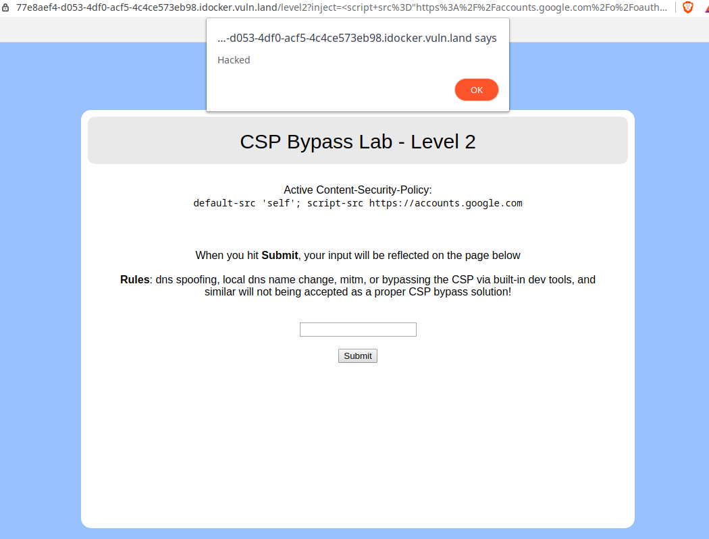

# CSP Bypass Level 1

## content-security-policy header
`default-src 'self'; script-src https://accounts.google.com`

### Analysis
Taking a look at the header, there are two components:
- [`default-src`](#default-src)
- [`script-src`](#script-src)

#### default-src
The `default-src` component is set to `self`, which means, that only scripts on the same domain can be executed. However, this is only used as a **fallback**!

#### script-src
`script-src` controls, which scripts you can exactly run. In our case, it's restricted to a domain controlled by google `https://accounts.google.com`.

## Theory
My first theory was, to get some redirection setup to `drive.google.com`. However, I learned that http-code `302` redirections are catched by the CSP too.
My next theory was, that there may be a Javascript callback possible. After doing some research, I found this payload:
`https://accounts.google.com/o/oauth2/revoke?callback=INSERT_CODE_HERE`

## The exploit
To make it short, in our case, this code is, what I use to bypass the CSP:
```html
<script src="https://accounts.google.com/o/oauth2/revoke?callback=alert('Hacked')"></script>
```
This works, because Google invokes the code inside the `callback`-URL-Parameter.

## Fixing
To be honest, I don't actually know how one would fix this kind of problem. You either can just not use any Google-Sources which allow JavaScript callbacks, or you could remove any Regex match of this pattern, when receiving a request: `\?callback=.*&*`.
This only fixes this exploit though, and there may be some other callbacks on googles side.

## Screenshot

